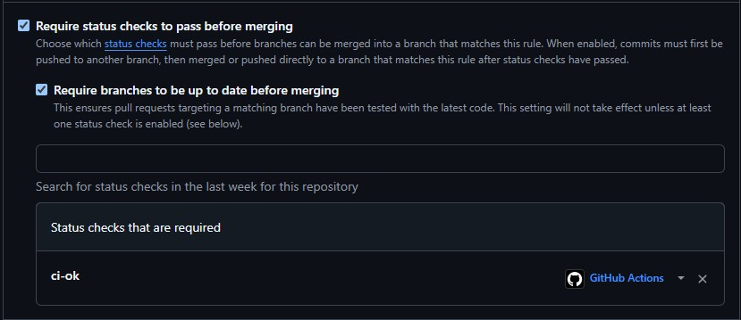

# Lab 3 — CI/CD

## Chosen path

**GitHub Actions.** I chose it because my course fork is hosted on GitHub and it
lets the required status check protect pull requests directly.

## Evidence

- Green workflow run: [QuickNotes CI run #9](https://github.com/ttrlen/DevOps-Intro/actions/runs/35266014896)
- Failed run: [deliberately failed QuickNotes CI run](https://github.com/ttrlen/DevOps-Intro/actions/runs/35261198794)
- Fix commit: [`ec2660e`](https://github.com/ttrlen/DevOps-Intro/commit/ec2660e6d14d5927b2c3a3cffe27bf71e54fc3f2)
- Technical CI PR: [PR #2](https://github.com/ttrlen/DevOps-Intro/pull/2)
- Branch-protection screenshot:

  

## Task 1 — design answers

### a) Why pin `ubuntu-24.04`?

`ubuntu-latest` is a moving alias. When GitHub changes what it points to, the
image can gain/remove tools or libraries and a previously green pipeline can
start behaving differently without a repository change. Pinning the Ubuntu LTS
image makes the runner environment reproducible; upgrades become an explicit,
reviewable change.

### b) Why separate vet, test, and lint?

They are independent checks, so separate jobs run concurrently and report the
specific failed quality gate. A single combined job would run them serially: it
would take longer, stop at the first failure, give a less precise required
check, and make it harder to see whether multiple checks fail.

### c) What does SHA pinning prevent?

An action tag is mutable. SHA pinning fixes the exact action code that runs, so
an attacker who moves a tag cannot silently substitute malicious CI code. The
Lecture 3 example was the **March 2025 `tj-actions/changed-files` compromise**:
the attacker rewrote action tags and exposed secrets from many public CI runs.

### d) What is `permissions:`?

It defines what the workflow's `GITHUB_TOKEN` may do. This workflow declares
only `contents: read`, because it only checks out and analyzes source code. This
is the principle of least privilege: a compromised action has only the smallest
set of repository capabilities required for the job.

## Task 2 — optimizations and findings

The workflow has the following optimizations:

1. `actions/setup-go` caches the Go module and tool-managed build caches. Its
   key uses `app/go.mod` because this project currently has no `go.sum` and no
   third-party module requirements.
2. `vet` and `test` each run as a two-version matrix (`1.23`, `1.24`) with
   `fail-fast: false`.
3. Workflow triggers are restricted to `app/**` and the workflow file, so a
   documentation-only change does not start CI.
4. `ci-ok` aggregates the three gates, so branch protection needs one stable
   check rather than matrix-generated check names.

| Scenario | Wall-clock |
|---|---:|
| Baseline (no cache, single Go version, no path filter) | 34 s |
| With cache | 39 s |
| With cache + matrix | 47 s |

### f) Why cache `go.sum`-keyed inputs rather than build outputs?

`go.sum` pins the exact dependency contents, so it is a deterministic cache
input: when it changes, the dependency cache must be rebuilt. Reusing arbitrary
application build artifacts risks using output made for a different source,
platform, or toolchain. Go's own build cache is an exception here: it is a
tool-managed intermediate cache whose entries are content- and toolchain-keyed;
this workflow does not cache deployable application binaries.

### g) What does `fail-fast: false` do?

It allows all matrix cells to finish even if one cell fails, so the PR author
can see every broken Go-version/check combination in one run. `fail-fast: true`
is useful when jobs are expensive and one failure is enough to stop the
investigation, for example a quick blocking smoke test.

### h) What is the cache-poisoning risk?

If an attacker can write a cache from untrusted PR code, a trusted workflow may
later restore attacker-controlled files and execute them. Caches must never
contain secrets and restored content must be treated as untrusted. GitHub
mitigates this by giving low-trust workflows read-only access to the default
branch cache scope; PR-run caches are also scoped to their merge reference.
See [GitHub's dependency-cache security documentation](https://docs.github.com/en/actions/concepts/workflows-and-actions/dependency-caching#cache-security).

## Bonus Task — pipeline performance investigation

The final full pipeline completed in **40 s**, so it meets the ≤90 s goal.
The GitHub Actions run summary recorded a 15 s lint job and a 2 s `ci-ok`
job; the matrix jobs ran in parallel. The remaining time is mostly GitHub-hosted
runner allocation, checkout, and Go/tool setup rather than QuickNotes work.

Additional optimizations applied beyond Task 2:

1. `GOFLAGS=-buildvcs=false` avoids VCS metadata inspection during Go commands.
2. The linter uses its release binary and its action cache, avoiding `go install`
   and allowing its own cache to be restored between runs.
3. A concurrency group cancels superseded CI runs for the same pull request,
   avoiding work on obsolete commits.
4. Vet, test, and lint use independent jobs and therefore run in parallel;
   `ci-ok` waits only for their results.

| Optimization applied | Before (s) | After (s) | Saving |
|---|---:|---:|---:|
| `GOFLAGS` and cached binary linter, full matrix run | 47 | 40 | -7 |
| Lint job with restored linter cache | 21 | 15 | -6 |
| Cancel superseded PR runs | N/A | N/A | avoids obsolete runs |
| **Total wall-clock** | **47** | **40** | **-7** |

Runner provisioning and tool setup dominate the remaining duration, while the
QuickNotes checks themselves are small. To make the application work shorter,
the project would need less test/analysis work or fewer supported Go versions,
but that would reduce useful coverage rather than improve CI design. I would
stop optimizing at roughly 40–45 seconds: the remaining variation comes from
shared hosted infrastructure and the engineering effort is better spent on
application changes. A dependency-heavy project would benefit much more from
the dependency and linter caches than this zero-dependency project does.

## Manual checks still required

1. Push this branch and open a draft PR to `main`; replace the evidence
   placeholders above with the actual run URLs/screenshots and timings.
2. Make a temporary failing test commit, push it, capture the red run, then add
   a follow-up commit that restores the test and capture the green run.
3. In **Settings → Branches → main**, require the single `ci-ok` status check
   and require the branch to be up to date before merging. Save a screenshot.
