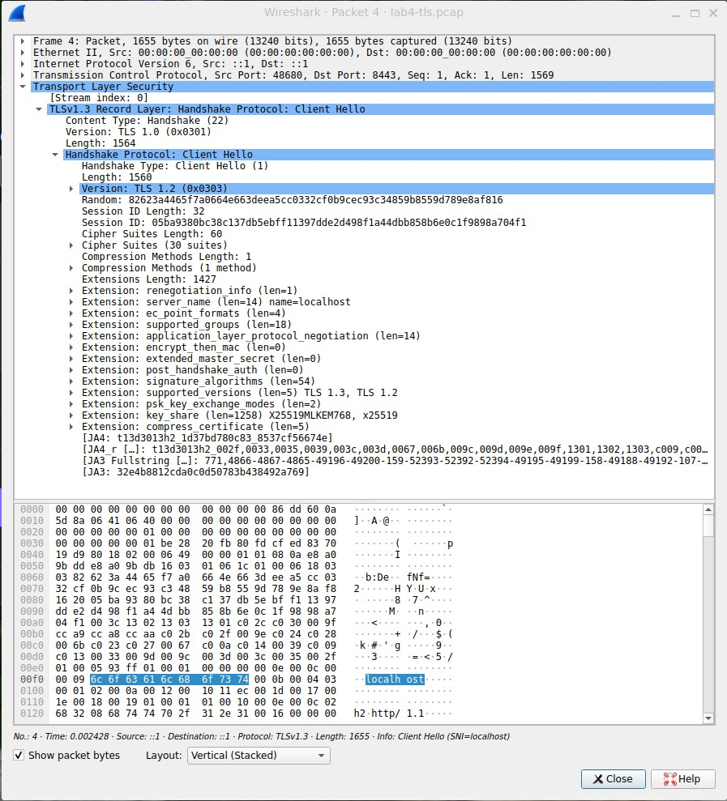
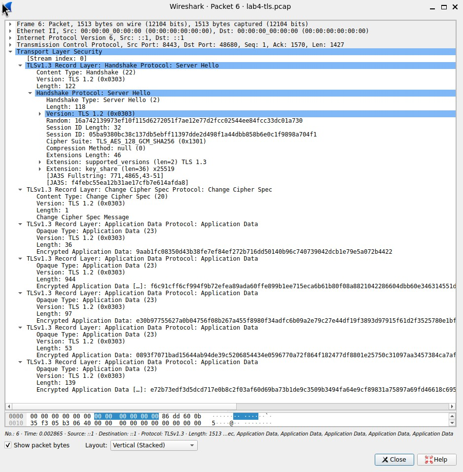

# Lab 4 — OS & Networking

**Run date:** 17 September 2026
**Environment:** WSL2/Linux; QuickNotes listens on `*:8080`.

## Task 1 — trace one request

I captured loopback traffic to `submissions/lab4-trace.pcap` while QuickNotes
was running, then decoded it into `lab4-trace.txt`.

### HTTP transcript

The annotated packet decode is in [`lab4-trace.txt`](lab4-trace.txt). The
important observations are:

- At `23:35:06.147610`, `23:35:06.147630`, and `23:35:06.147643`, the
  client and server complete `SYN` → `SYN/ACK` → `ACK` on `::1:8080`.
- At `23:35:06.147793`, `POST /notes HTTP/1.1` carries the 39-byte JSON body
  `{"title":"trace me","body":"in flight"}`.
- At `23:35:06.160294`, QuickNotes returns `HTTP/1.1 201 Created` and the
  persisted note JSON (id 7).
- At `23:35:06.160573`, `23:35:06.160669`, and `23:35:06.160743`, the two
  endpoints exchange `FIN/ACK`, `FIN/ACK`, and the final `ACK` to close TCP.

### Five debugging commands

```text
$ ss -tlnp | grep ':8080'
LISTEN 0      4096                *:8080             *:*    users:(("quicknotes",pid=6001,fd=3))

$ ip route show
default via 172.21.240.1 dev eth0 proto kernel
172.21.240.0/20 dev eth0 proto kernel scope link src 172.21.244.164

$ mtr -rwc 5 localhost
Start: 2026-09-17T23:42:34+0300
HOST: DESKTOP-QB0HM16 Loss%   Snt   Last   Avg  Best  Wrst StDev
  1.|-- localhost        0.0%     5    0.1   0.1   0.0   0.1   0.0

$ dig +short example.com @1.1.1.1
8.6.112.0
8.47.69.0

$ journalctl --user -u quicknotes -n 20
-- No entries --
```

`ss` proves that the expected QuickNotes process owns port 8080 on all local
addresses. The route output is the WSL virtual-network default route; traffic
to `localhost` uses loopback and does not traverse that default route. `mtr`
shows five loopback probes with no loss, and `dig` confirms that the external
resolver at `1.1.1.1` returned A records for `example.com`. There is no user
`quicknotes.service` in this environment, hence no journal entries.

### If QuickNotes returned 502

I would first determine which proxy produced the 502 and inspect its error log,
because a 502 means the proxy did not obtain a valid upstream response. Next I
would check the upstream from the proxy's network namespace with `curl`, then
verify the application process and listener using `ss -tlnp`. I would compare
the proxy's configured upstream host/port with `ADDR`, check recent application
logs for a crash or bind failure, and only then investigate firewall, DNS, TLS
verification, timeout, and load-balancer health-check failures. This order
quickly separates an unavailable process from an incorrect route or proxy
configuration.

## Task 2 — outside-in debugging

### Reproduction

With the first QuickNotes instance already listening on `:8080`, I started a
second instance with the same address:

```bash
ADDR=:8080 go run . 2>&1 | tee /tmp/qn-broken.log
```

The second process failed exactly as expected:

```text
2026/09/17 23:46:16 quicknotes listening on :8080 (notes loaded: 7)
2026/09/17 23:46:17 listen: listen tcp :8080: bind: address already in use
exit status 1
```

### Outside-in chain

| Step | Command and observed output | Decision |
|---|---|---|
| Process | `ps -ef \| grep quicknotes \| grep -v grep` → `/tmp/go-build2932978276/b001/exe/quicknotes` was running (PID 6001). | The first instance is alive. |
| Socket | `ss -tlnp \| grep 8080` → `LISTEN ... *:8080 ... quicknotes,pid=6001,fd=3`. | The port is already owned by the first process. |
| Local reachability | `curl -s -o /dev/null -w '%{http_code}\\n' http://localhost:8080/health` → `200`. | The live instance is healthy; this is not an application outage. |
| Firewall | `sudo iptables -L -n -v 2>/dev/null \|\| sudo nft list ruleset 2>/dev/null \|\| true` produced no rule output after authentication. | No local blocking rule was shown; a firewall cannot explain a local bind collision. |
| DNS | `dig +short localhost` → `127.0.0.1`. | `localhost` resolves locally as expected. |

### Repair and re-verification

I stopped the owning process with `kill 6001`, confirmed that `ss -tlnp | grep
8080` had no output, then started QuickNotes again:

```text
2026/09/17 23:53:23 quicknotes listening on :8080 (notes loaded: 7)
$ curl -s http://localhost:8080/health
{"notes":7,"status":"ok"}
```

**Root cause:** the second QuickNotes process attempted to bind an address that
was already in use by the first process.

### Blameless mini-postmortem

The failed start was caused by two independent launch attempts sharing one
fixed port, not by an individual mistake. A manual workflow provides no
ownership check, preflight check, or clear lifecycle management, so a stale
development process is easy to overlook. The running instance remained healthy
and the second process failed safely; the operational gap was discoverability.
We can reduce recurrence by running one managed user service, adding an
`ExecStartPre` port-availability check or an explicit restart operation, and
exposing readiness checks and structured startup logs. A small `make run` or
developer script that reports the owning PID when the address is taken would
make the diagnosis immediate. Monitoring the service state and alerting on
repeated restart failures would catch the same pattern in deployment.

## Bonus — TLS termination and handshake

I configured Caddy as an HTTPS reverse proxy for QuickNotes:

```caddyfile
localhost:8443 {
  tls internal
  reverse_proxy localhost:8080
}
```

`systemctl is-active caddy` returned `active`. The TLS capture is stored in
[`lab4-tls.pcap`](lab4-tls.pcap), its TCP-level decode is in
[`lab4-tls.txt`](lab4-tls.txt), and the certificate-chain output is in
[`lab4-cert-chain.txt`](lab4-cert-chain.txt).

`curl -vk https://localhost:8443/health` showed this negotiation and successful
proxied request:

```text
* TLSv1.3 (OUT), TLS handshake, Client hello (1)
* TLSv1.3 (IN), TLS handshake, Server hello (2)
* TLSv1.3 (IN), TLS handshake, Encrypted Extensions (8)
* TLSv1.3 (IN), TLS handshake, Certificate (11)
* TLSv1.3 (IN), TLS handshake, CERT verify (15)
* TLSv1.3 (IN), TLS handshake, Finished (20)
* SSL connection using TLSv1.3 / TLS_AES_128_GCM_SHA256 / x25519 / id-ecPublicKey
* ALPN: server accepted h2
> GET /health HTTP/2
< HTTP/2 200
< server: Caddy
{"notes":7,"status":"ok"}
```

`openssl s_client -connect localhost:8443 -servername localhost -showcerts`
reported a two-certificate local Caddy chain: a leaf certificate for
`localhost` issued by `Caddy Local Authority - ECC Intermediate`, followed by
that ECC intermediate. Both use the `prime256v1` EC key and
`ecdsa-with-SHA256`. The negotiated protocol is `TLSv1.3` and the cipher is
`TLS_AES_128_GCM_SHA256`; the ephemeral key is X25519. The verification warning
(`unable to get local issuer certificate`) is expected because Caddy's local
development root is not in OpenSSL's trust store; `curl -k` was used only for
this local test.

### Wireshark evidence

The ClientHello screenshot shows 30 offered cipher suites, SNI
`server_name: localhost`, and the `supported_versions` extension with TLS 1.3
and TLS 1.2.



The ServerHello screenshot shows Caddy selected TLS 1.3 and
`TLS_AES_128_GCM_SHA256` with the X25519 key share.



The negotiation step that rejects TLS 1.0 and TLS 1.1 is the version selection
in **ClientHello/ServerHello**: the client advertises supported versions and
the server selects one only if it meets its minimum policy. A modern Caddy TLS
policy does not negotiate TLS 1.0 or 1.1. Deprecating those versions in 2026
avoids obsolete cryptography and downgrade/legacy-protocol risks; this capture
negotiated TLS 1.3.
