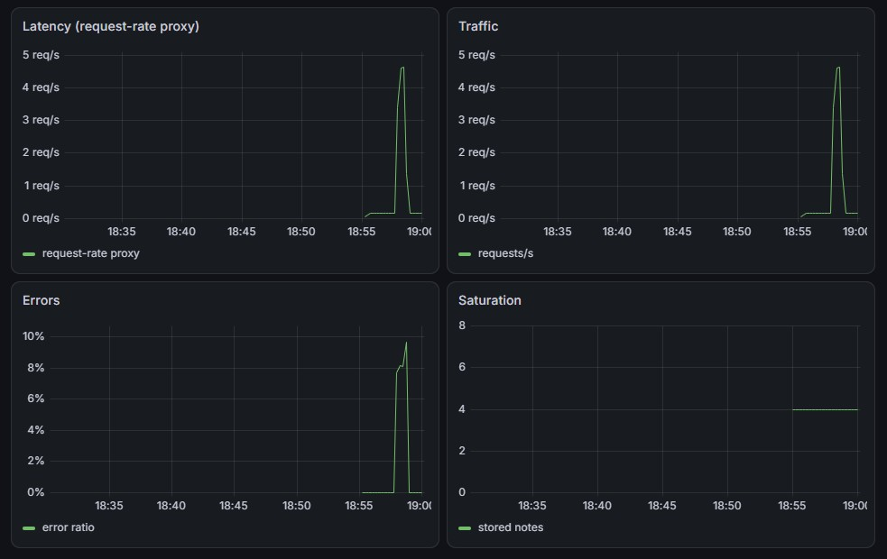
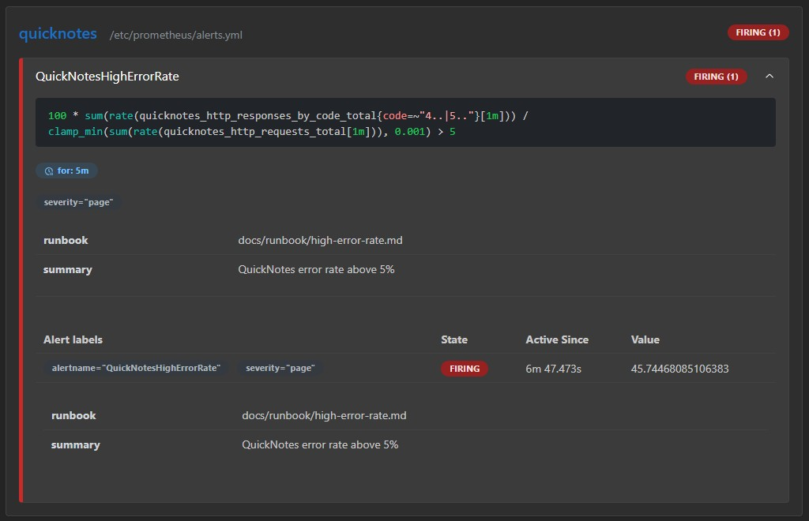
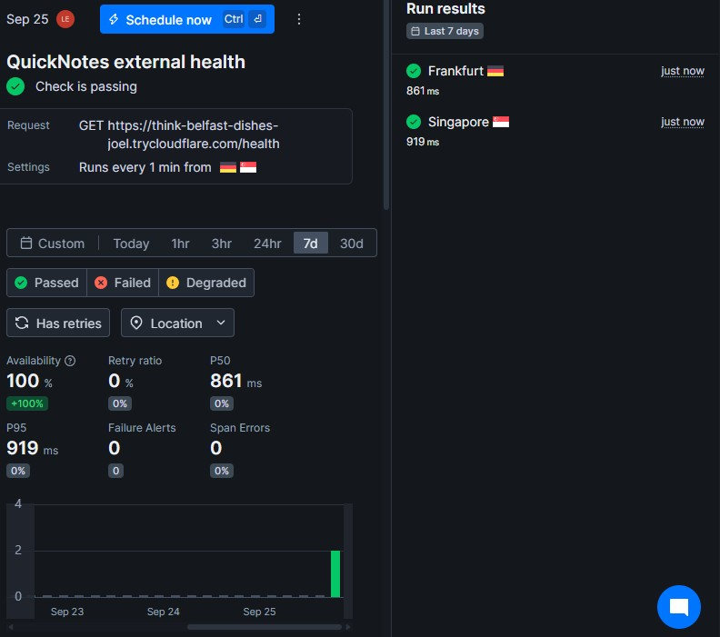
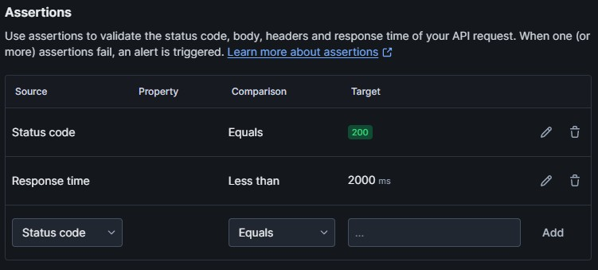
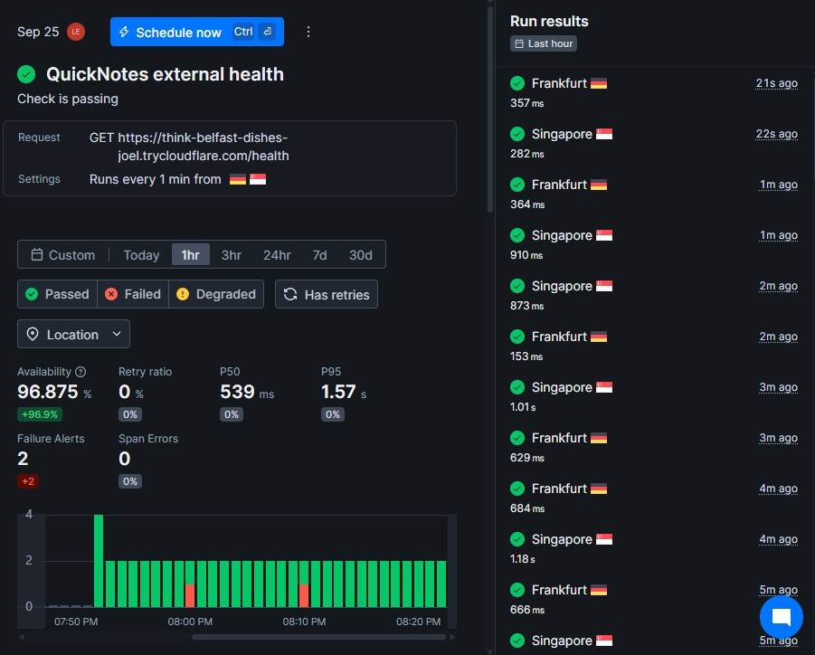

# Lab 8 — SRE & Monitoring

## Artifacts

- [Prometheus configuration](../monitoring/prometheus/prometheus.yml)
- [Grafana datasource provisioning](../monitoring/grafana/provisioning/datasources/datasource.yml)
- [Grafana dashboard provisioning](../monitoring/grafana/provisioning/dashboards/dashboard.yml)
- [Golden Signals dashboard JSON](../monitoring/grafana/dashboards/golden-signals.json)
- [Prometheus alert rule](../monitoring/prometheus/alerts.yml)
- [High error rate runbook](../docs/runbook/high-error-rate.md)

## Task 1 — Prometheus and Grafana

### Prometheus target verification

```text
$ curl -s http://localhost:9090/api/v1/targets | jq '.data.activeTargets[].health'
"up"
```

### Provisioned Golden Signals dashboard



The dashboard is automatically provisioned and contains four panels:

1. Latency, using request rate as the permitted proxy because QuickNotes exposes no request-duration histogram.
2. Traffic, using `rate(quicknotes_http_requests_total[1m])`.
3. Errors, using the ratio of 4xx and 5xx responses to all requests.
4. Saturation, using the `quicknotes_notes_total` gauge.

### Design questions

#### a) Pull versus push

Prometheus pulls metrics: the Prometheus server must be able to reach QuickNotes at `quicknotes:8080` over the Compose network. QuickNotes does not initiate a connection to Prometheus. If Prometheus cannot reach QuickNotes, the scrape fails, the target becomes `up == 0`, and metric series eventually become stale.

#### b) Scrape interval

A 5-second scrape interval creates much more ingestion, storage, and query load, while short-window rate queries become noisier and can overemphasize small bursts. A 5-minute interval makes dashboards slow and sparse, delays detection, and can miss short failures. It also gives too few samples for useful short-range `rate()` queries.

#### c) `rate()` versus `irate()` versus `delta()`

The Traffic panel uses `rate()` because it returns a per-second average over a time range and produces a stable graph for a monotonically increasing counter. `irate()` uses only the two newest samples, so it is useful for investigating short spikes but is too jumpy for the main traffic panel. `delta()` is for raw change over a range and is not appropriate for a counter because it does not handle counter resets as `rate()` does.

#### d) Why provision Grafana from files

File provisioning makes the datasource and dashboard reproducible, version-controlled, reviewable, and available on every fresh Compose startup. It avoids undocumented manual UI changes and configuration drift.

## Task 2 — One Good Alert and Runbook

### Alert rule

```yaml
groups:
  - name: quicknotes
    rules:
      - alert: QuickNotesHighErrorRate
        expr: |
          100 * sum(rate(quicknotes_http_responses_by_code_total{code=~"4..|5.."}[1m])) / clamp_min(sum(rate(quicknotes_http_requests_total[1m])), 0.001) > 5
        for: 5m
        labels:
          severity: page
        annotations:
          summary: QuickNotes error rate above 5%
          runbook: docs/runbook/high-error-rate.md
```

### Alert firing evidence



The alert fired after intentionally generating malformed `POST /notes` requests alongside healthy requests for more than five minutes.

### Runbook

# QuickNotes High Error Rate

## What this alert means

QuickNotes has returned 4xx or 5xx responses for more than 5% of requests for at least five consecutive minutes.

## Triage steps

1. Open the QuickNotes Golden Signals dashboard and confirm that the Errors panel is above 5%.
2. Identify the failing status codes in Prometheus with `sum by (code) (rate(quicknotes_http_responses_by_code_total[5m]))`.
3. Check service health with `docker compose ps` and inspect recent application logs with `docker compose logs --since 15m quicknotes`.
4. Check whether a recent deployment, configuration change, or client release coincides with the start of the errors.

## Mitigations

- Roll back QuickNotes to the last known-good image or deployment version if a recent change caused the errors.
- Block or rate-limit the client or request pattern producing malformed requests while the underlying issue is investigated.
- Restart QuickNotes only when logs indicate a transient failure and a restart is unlikely to lose data.

## Post-incident

Record the incident timeline, impact, root cause, and follow-up actions in a blameless postmortem. Use the [Lecture 1 blameless postmortems guidance](../lectures/lec1.md#-slide-20--blameless-postmortems) and create actions that make recurrence less likely.

### Design questions

#### e) Why sustain the breach for five minutes?

A single bad request can be a client mistake, a transient network issue, or a brief deployment effect. Requiring five continuous minutes confirms user impact is sustained and prevents unnecessary pages.

#### f) Symptom alerts versus cause alerts

High error rate is a symptom alert because it directly represents failed user requests. A cause alert might page on high container CPU usage or low disk space. Cause alerts are worse as primary pages because a resource threshold can be crossed while users are unaffected, and a real failure can happen without that particular resource crossing its threshold.

#### g) Alert-fatigue threshold

The alert is too noisy if more than 5% of its pages occur when users were not actually affected. That threshold should trigger investigation and tightening of the alert condition.

## Bonus — External Synthetic Monitoring

A temporary Cloudflare Quick Tunnel exposed QuickNotes at:

```text
https://think-belfast-dishes-joel.trycloudflare.com/health
```

A Checkly API check named `QuickNotes external health` sends a `GET` request every minute from Frankfurt and Singapore. It asserts HTTP status `200` and response time below `2000 ms`.





The Checkly monitor was left running for at least 30 minutes.



### Internal and external comparison

| Metric | Prometheus (inside the Compose network) | Checkly (Frankfurt and Singapore) |
|---|---|---|
| Avg latency p50 | N/A: QuickNotes exposes no duration histogram | 539 ms |
| Avg latency p95 | N/A: QuickNotes exposes no duration histogram | 1.57 s |
| Errors observed | 0 4xx/5xx errors in the last 30 minutes | 2 failure alerts; 96.875% availability |

Prometheus cannot calculate latency percentiles because QuickNotes does not expose a duration histogram; its Latency dashboard panel uses the allowed request-rate proxy instead. Checkly can catch failures in the public DNS path, Cloudflare tunnel, external TLS connectivity, or regional network paths that Prometheus inside the Compose network cannot see. Prometheus can catch detailed application-level response-code changes and internal service reachability even when an external probe is too infrequent to see every failure. Prometheus also exposes application saturation through `quicknotes_notes_total`, while Checkly only observes the public HTTP endpoint. The two systems therefore complement each other rather than duplicate each other.
